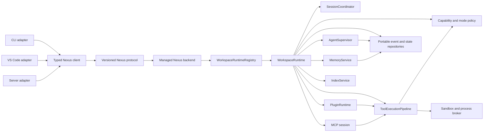

# NexusCode Runtime Re-architecture Design

**Date:** 2026-07-26

**Status:** Approved; foundation implemented; workspace-runtime migration in progress

**Primary references:** Codex for protocol, session semantics, safety, and canonical
rollouts; Kilo/OpenCode for the server-first process topology and transactional
runtime state; OpenClaude for providers, plugins, hooks, and orchestration

**Secondary references:** Roo Code for selected checkpoint, editor-host, and
optional indexing patterns; Cline and Claw Code for targeted UX and recovery
patterns

## 1. Decision

NexusCode will replace its current internal runtime with a workspace-owned,
server-first, capability-based architecture while preserving the public user
experience through compatibility adapters and automatic migrations.

One long-lived `WorkspaceRuntime` owns every session, task, subagent, plugin,
MCP connection, memory service, and background activity for one canonical
workspace directory. CLI, VS Code, and remote clients use the same versioned
protocol through either an in-process or HTTP/SSE transport. A turn is a
short-lived activity inside a session; it never owns workspace services.

This is not a feature-reduction rewrite. Every supported feature must either:

1. move to the new runtime with equivalent or better behavior;
2. be temporarily served by a compatibility adapter with an explicit migration test; or
3. be removed only when it is proven dead, undocumented, unreachable, and has no persisted data or external compatibility impact.

The implementation will use a strangler migration rather than a big-bang rewrite. New runtime components become authoritative one boundary at a time. Old implementations are removed as soon as their parity tests pass so that Nexus does not retain two execution paths.

## 2. Why This Work Is Necessary

The current codebase has broad product ambition but weak runtime invariants:

- tool execution is duplicated between the main loop, `processor.ts`, and `tool-execution.ts`;
- parallel reads and textual tool-call fallback bypass parts of plugin hook execution;
- several manager-bound task tools are silently rejected by the registry;
- process-global MCP and parallel-agent managers can leak state across concurrent runs;
- orchestration rewrites one unversioned JSON file without transactions or cross-process locking;
- CLI non-interactive mode and the server approve privileged actions by default;
- the server has no authentication and accepts arbitrary workspace directories;
- the Bash schema claims sandbox support that is not implemented;
- memory is split across several stores with inconsistent retrieval and trust semantics;
- configuration precedence differs between CLI, VS Code, and server;
- rules, skills, MCP, and indexing can silently disappear after short startup timeouts;
- the agent runtime, modes, plugins, server, and orchestration have effectively no first-party tests.

The new design treats these as one systemic problem: Nexus lacks a single authoritative runtime boundary. Fixing each symptom independently would preserve the underlying drift.

### 2.1 Evidence hierarchy and feature archaeology

Current documentation is not treated as proof that a feature works. The evidence hierarchy for the migration is:

1. a passing end-to-end or integration test through a public surface;
2. a passing runtime contract test;
3. a reachable executable path confirmed from registration through result rendering;
4. persisted data showing that the path has been used;
5. source comments and documentation.

Every claimed feature receives a feature-census entry that traces:

`configuration → construction/registration → model/tool exposure → policy → execution → persistence → protocol events → CLI/VS Code/server rendering → cleanup/recovery`

The census classifies each feature as working, partially working, unreachable, duplicated, unsafe, or documentation-only. A feature is not declared preserved merely because a class, schema, setting, command, or README section exists.

Documented features that are useful and consistent with the product goals must be made real and covered by tests. Documentation-only or unreachable behavior may be removed only after its intended value has been implemented elsewhere or it is explicitly classified as obsolete with no data/compatibility impact. Documentation is corrected in the same change that alters behavior.

## 3. Goals

### 3.1 Product goals

- Preserve and improve all existing CLI, VS Code, and server features.
- Provide strong coding-agent behavior across agent, plan, ask, debug, and review modes.
- Support durable single-agent, subagent, team, worktree, shell-job, and remote workflows.
- Make memory useful, multilingual, inspectable, and resistant to prompt poisoning.
- Make plugins and MCP first-class without allowing them to bypass permissions or session isolation.
- Keep the current broad provider ecosystem while normalizing provider-specific behavior.
- Combine Codex-grade execution discipline and safety with OpenClaude-grade orchestration and lifecycle depth.
- Adopt Kilo's strongest memory, recall, packaging, observability, and multi-surface ideas.
- Adopt Roo's proven vector index, checkpoint, tool-contract, and VS Code patterns where they outperform the current implementation.

### 3.2 Engineering goals

- One authoritative tool execution pipeline.
- No process-global mutable run state.
- Transactional, versioned persistence.
- Versioned runtime protocol shared by every surface.
- Fail-closed security decisions.
- Explicit ownership and cleanup of every long-lived resource.
- Deterministic hook and event ordering.
- Crash-safe run recovery and idempotent reconnect.
- Testable modules with narrow interfaces and files that remain understandable in isolation.
- Automatic migrations for existing sessions, orchestration state, memories, settings, and plugin metadata.

### 3.3 Compatibility goals

The following are compatibility contracts:

- existing `.nexus/nexus.yaml` and global configuration;
- environment-variable and secrets-store resolution;
- existing session IDs and readable session history;
- existing Markdown rules, skills, auto-memory, team-memory, and session-memory files;
- existing plugin manifests and installed plugin directories;
- existing MCP configuration;
- current CLI command names and common flags;
- current VS Code commands and saved extension settings;
- tool-call history stored with legacy tool names;
- remote client behavior where it was already documented.

Compatibility does not require preserving unsafe defaults. Unsafe behavior will migrate to safe defaults with explicit opt-in capability profiles.

## 4. Non-goals

- Reproducing another agent's UI or internal module layout verbatim.
- Keeping duplicate legacy engines indefinitely.
- Treating exact prompt wording as a stable public API.
- Guaranteeing that an unsafe plugin continues to execute without new capability approval.
- Preserving undocumented behavior that violates mode or security guarantees.
- Adding cloud billing, hosted accounts, or organization administration during the runtime migration.

## 5. Reference Hierarchy

### 5.1 Codex

Codex is the primary reference for:

- sandboxing and capability enforcement;
- approval policy and fail-closed execution;
- versioned app-server protocol;
- exec isolation and process lifecycle;
- rollout/event recording and replay;
- session-scoped state;
- integration testing and runtime invariants;
- worktree-safe coding workflows.

### 5.2 Kilo Code / OpenCode

Kilo/OpenCode is the primary reference for:

- one managed backend process shared by all VS Code views;
- a shared connection service, generated client, and global event stream;
- directory-scoped runtime instances inside one server;
- durable input admission and `steer`/`queue` promotion;
- transactional event sequencing and projections;
- catalog contribution scopes and lifecycle cleanup;
- packaging a backend independently of the extension host runtime.

Kilo's unfinished V2 features are not copied blindly. Only behavior backed by
source, schema, and tests becomes a Nexus contract.

### 5.3 OpenClaude

OpenClaude is an equal primary reference for:

- subagents, teammates, inboxes, swarms, and task lifecycle;
- backgrounding, daemon-style execution, resume, and remote control;
- plugin and hook lifecycle;
- memory and project instruction compatibility;
- schedules, long-running jobs, and orchestration ergonomics;
- rich terminal-agent behavior.

### 5.4 Roo Code

Roo is a targeted reference for:

- tested VS Code host behavior;
- code index and vector database lifecycle;
- checkpoints and revert behavior;
- tool validation and repetition detection;
- mode UX and extension integration.

## 6. Target Architecture

### 6.1 `WorkspaceRuntime`

Each canonical workspace owns one long-lived `WorkspaceRuntime`. It is
constructed from immutable resolved configuration plus explicit host services
and is registered in a process-owned `WorkspaceRuntimeRegistry`.

It owns:

- session coordinators and active turn identities;
- model catalog, provider descriptors, and capability metadata;
- tool registry;
- tool execution pipeline;
- capability and mode policy;
- agent supervisor;
- managed MCP supervisor;
- plugin runtime;
- memory service;
- index service handle;
- SQLite state database and JSONL rollout writer;
- cancellation tree;
- observability and redaction context.

No tool obtains state through an unowned process-global singleton. Child agents
receive an explicit child session whose capabilities are an equal or narrower
subset of the parent while its lifecycle remains owned by the workspace
supervisor.

`WorkspaceRuntime.close()` is mandatory and idempotent. It cancels or safely
detaches owned work, drains events, releases MCP transports, stops jobs
according to policy, removes listeners, checkpoints WAL state, and releases
database/index resources.

### 6.2 `SessionCoordinator`

Every session is an actor-like coordinator with one serialized command
mailbox. It accepts idempotent commands for input admission, turn start,
steering, queueing, interruption, and approval. Different sessions may execute
concurrently, but one session has at most one active turn.

Input is admitted durably before provider or tool side effects. `steer`
messages are promoted at the next safe boundary of the current turn; `queue`
messages start distinct FIFO turns. Tool calls are durably recorded before
execution. A tool left running after a crash becomes `interrupted` and is not
automatically replayed.

### 6.3 Surface adapters

CLI, VS Code, and server become thin adapters. They may render UI and perform host-specific file previews, but they do not implement security policy, tool semantics, retries, or orchestration logic.

Every adapter uses the same versioned protocol types and the same runtime commands:

- create/open session;
- submit turn;
- approve/deny capability request;
- cancel run;
- subscribe/replay events;
- inspect tasks, memory, plugins, MCP, and index status;
- request checkpoint/revert;
- close or detach.

The CLI may use an in-process transport when no backend is available. The VS
Code extension uses one bundled managed backend and one shared connection
service; it never contains a second agent loop. Both transports exercise the
same protocol handlers.

## 7. Versioned Runtime Protocol

The protocol is a discriminated, schema-validated command/event model with explicit version numbers.

Every event has:

- protocol version;
- run ID and session ID;
- monotonically increasing run sequence;
- event ID;
- timestamp;
- optional parent event/tool/task ID;
- redacted payload;
- persistence status.

Run events are written transactionally before being delivered to subscribers. Reconnect uses `afterSequence` and remains valid across process restarts.

Commands that can be retried have idempotency keys. A repeated command returns the original result rather than re-executing a mutation.

Legacy `AgentEvent` objects are supported through an adapter until CLI and VS Code migrate. The adapter is tested against recorded legacy event fixtures.

## 8. Tool Registry and Execution

### 8.1 Tool definitions

Tools are registered through factories that receive scoped dependencies. The registry distinguishes:

- built-in static tools;
- built-in bound tools such as task/supervisor tools;
- MCP tools;
- trusted plugin tools;
- compatibility-only legacy tools.

Reserved names prevent third-party replacement but do not block bound built-ins. Duplicate registration produces an explicit diagnostic and never silently returns.

Each tool declares:

- stable name and schema version;
- input and output schemas;
- capability requirements;
- read/write/execute/network classification;
- mode availability;
- concurrency class;
- idempotency behavior;
- cancellation behavior;
- output sensitivity;
- whether results may enter long-term memory.

### 8.2 One execution pipeline

All calls use this exact sequence:

1. resolve aliases and tool version;
2. normalize provider-specific input;
3. validate the input schema;
4. resolve mode policy;
5. resolve capability policy;
6. execute deterministic `before_tool` hooks;
7. request approval when policy requires it;
8. acquire concurrency/resource leases;
9. execute through the appropriate broker;
10. validate the output schema;
11. redact sensitive values;
12. store oversized output as a content-addressed blob;
13. execute `after_tool` hooks;
14. persist tool result and events;
15. deliver the normalized result to the model and surfaces.

Native provider tool calls, textual fallback calls, parallel calls, MCP calls, plugin tools, and subagent-mediated calls cannot bypass this pipeline.

Security hooks fail closed. Observability-only after hooks may fail open, but their failure is persisted and visible.

### 8.3 Parallelism

Parallel execution is allowed only when tools declare compatible concurrency classes and their resolved resource scopes do not conflict.

The scheduler prevents:

- concurrent writes to the same file;
- a read racing a pending write where a consistent snapshot is required;
- multiple edits to the same document version;
- child agents sharing a mutable working directory without an explicit collaboration policy.

Parallel results preserve deterministic ordering by original call index while retaining actual timing metadata.

### 8.4 Output handling

Output limits apply uniformly. Full output is stored in a content-addressed blob store with:

- byte length and checksum;
- MIME type and encoding;
- sensitivity classification;
- originating tool/run;
- retention policy.

The model receives a bounded head/tail or structured summary plus a stable blob reference. Read supports byte/range and line-range access without loading an entire large file.

## 9. Modes and Capability Policy

Modes are policy documents, not prompt-only conventions.

### 9.1 Agent

Agent may read, write, execute, use network/MCP, create tasks, and manage orchestration according to configured capabilities and approvals.

### 9.2 Plan

Plan may inspect the repository, use safe research tools, create read-only research subagents, and write only approved plan artifacts. It cannot execute arbitrary shell commands or mutate plugins, teams, remotes, or source files.

### 9.3 Ask

Ask is read-only. Delegated agents inherit read-only capabilities. It cannot use shell, mutate persistent memory, or make mutating MCP calls.

### 9.4 Debug

Debug has agent capabilities but injects and enforces a diagnose-before-mutate state machine. The runtime records the evidence that justified a mutation.

### 9.5 Review

Review is read-only. Git inspection is provided through a dedicated read-only Git tool or an allowlisted sandbox profile. Arbitrary Bash is not available.

### 9.6 Transitions

Mode transitions are explicit runtime commands, persisted as events, validated against allowed transitions, and reflected immediately in both the prompt and tool manifest.

Mode tests prove that no forbidden capability can be reached through aliases, plugins, MCP, subagents, textual tool calls, background jobs, or shell indirection.

## 10. Sandbox and Security

The capability engine is authoritative below the model and plugin layers.

Capabilities include:

- filesystem read roots;
- filesystem write roots;
- process execution profiles;
- network destinations and methods;
- MCP server/tool access;
- secrets access;
- plugin lifecycle operations;
- worktree and Git mutation;
- remote-session control;
- long-term memory mutation.

Platform process isolation follows Codex-style architecture:

- macOS: Seatbelt profile plus process-group control;
- Linux: bubblewrap/Landlock/seccomp where available;
- Windows: restricted token, job object, and filesystem/network policy where available;
- unsupported environments: explicit degraded-mode diagnostic, never a fake sandbox flag.

Non-interactive CLI is fail closed. Privileged actions require a declared policy file or explicit dangerous flag with environment validation.

Server requirements:

- random local bearer token by default;
- strict origin validation;
- no wildcard CORS;
- configured workspace-root allowlist;
- remote bind is opt-in and requires an explicit authentication configuration;
- request and event rate limits;
- no client-provided arbitrary directory outside configured roots;
- approvals are supplied by an authenticated client or policy, never auto-approved by the host.

Secrets are never written to event payloads, tool blobs, logs, or model-visible diagnostics. Redaction is centralized and tested.

## 11. Agent Supervisor and Orchestration

`AgentSupervisor` replaces global parallel-agent state and unifies:

- tracking tasks;
- delegated agent tasks;
- teams and members;
- inbox messages;
- background shell/process tasks;
- worktree sessions;
- snapshots;
- resume/fork lineage;
- remote sessions.

### 11.1 Task graph

Tasks form a persisted directed graph with dependencies, blocks, ownership, parent/child lineage, status, capabilities, and artifacts.

Status transitions are validated. Completion cannot occur while required children or blockers remain unresolved unless an explicit override is recorded.

### 11.2 Child agents

Every child agent has:

- a stable task/run identity;
- an explicit parent;
- a model and mode;
- a bounded context package;
- a capability subset;
- cwd or isolated worktree;
- concurrency lease;
- heartbeat and cancellation token;
- persisted output and snapshot;
- deterministic completion/error status.

Child agents cannot elevate permissions, replace the global MCP client, or acquire another run's manager.

The supervisor supports:

- blocking and background execution;
- bounded batch execution;
- cancellation propagation;
- resume and fork;
- crash reconciliation;
- orphan detection;
- task output streaming;
- per-agent token/tool/time budgets;
- team messaging with delivery state.

### 11.3 Recovery

After restart, durable tasks are reconciled:

- completed output remains available;
- detached processes are checked by stable process metadata where safe;
- interrupted agents become `interrupted` and may be resumed;
- running states are never left permanently stale;
- subscribers can replay the final persisted state.

## 12. Plugin Runtime

Plugins are powerful but not trusted implicitly.

### 12.1 Manifest and capabilities

A versioned manifest declares:

- plugin identity and version;
- entry points;
- tools, hooks, skills, commands, and MCP servers;
- requested filesystem, process, network, secret, and orchestration capabilities;
- compatibility range;
- integrity metadata;
- migration hooks.

Existing manifests migrate to the new schema. Missing capabilities are inferred conservatively and require user approval.

### 12.2 Isolation

Built-ins may run in process. Third-party executable plugin code runs in a supervised subprocess behind protocol IPC and the same OS sandbox/capability broker as tools.

Plugins do not receive raw host objects, database connections, secrets stores, or runtime internals. They receive a versioned capability client.

### 12.3 Hooks

Hook order is deterministic:

1. built-in security hooks;
2. organization/project policy hooks;
3. user plugin hooks ordered by configured priority;
4. observability hooks.

Each hook has a timeout and failure policy. `before_tool` may allow, deny, or return a schema-validated transformation only when granted that capability. Every decision is persisted.

Hooks run for native, textual, parallel, MCP, plugin, and subagent tool calls.

### 12.4 Lifecycle

Install, validate, trust, enable, configure, reload, migrate, disable, and remove are transactional. Failed activation rolls back to the last working plugin state.

Plugin provenance and integrity are visible in CLI and VS Code. Untrusted local code cannot be loaded merely because a file exists in a tools directory.

## 13. MCP

Each runtime owns its MCP session. Connections are reference-counted only by an explicit workspace service, never through a replaceable singleton.

MCP support includes:

- stdio and streamable HTTP transports;
- reconnect with bounded exponential backoff;
- OAuth callback and encrypted token persistence;
- resource and prompt support;
- rich text, image, audio, and embedded resource content;
- dynamic tool-list changes;
- per-server and per-tool capabilities;
- explicit read-only/mutating classification;
- cancellation and process-group cleanup;
- health and authentication status in every surface.

MCP content remains structured through the provider and UI pipeline. Unsupported model content is represented by a stored artifact and a faithful model-visible description, not discarded.

## 14. Unified Memory

### 14.1 Record model

Every memory record has:

- ID and schema version;
- scope: global, project, session, team, task, or agent;
- kind: fact, preference, command, architecture, decision, instruction, summary, or artifact reference;
- content and optional structured fields;
- source/provenance;
- author;
- trust level;
- created/updated/accessed timestamps;
- confidence;
- expiry or decay policy;
- sensitivity;
- embedding/index metadata;
- supersedes/contradicts relationships.

Instructions are distinct from remembered facts. Memory content never becomes an authoritative system instruction merely because it was stored.

### 14.2 Retrieval

Retrieval combines:

- Unicode-aware lexical search;
- vector similarity when available;
- scope and session affinity;
- recency and access frequency;
- confidence and trust;
- task relevance;
- contradiction and supersession filtering.

The retrieval algorithm works for Russian and other non-Latin languages. It has deterministic fallback behavior when embeddings are unavailable.

### 14.3 Prompt budget

Memory receives a strict token budget. Selection returns citations and reasons so users and traces can explain why each record was injected.

Potentially untrusted memory is quoted as evidence with provenance. It is never concatenated into the project-rules authority block.

### 14.4 Writes and consolidation

Memory writes use a pipeline:

1. classify proposed content;
2. redact secrets;
3. detect duplicates and contradictions;
4. determine scope and trust;
5. require approval for high-impact persistent instructions;
6. persist;
7. update lexical/vector indexes.

Session and auto-memory consolidation is serialized per session/project and cannot race another turn. Background consolidation survives cancellation independently when policy allows it.

### 14.5 Compatibility

Existing Markdown memory files are imported with provenance and remain readable/exportable. `@include` is constrained to approved roots and total byte/depth budgets.

## 15. Persistence

Repository interfaces are authoritative and hide the database implementation
from agent, tool, plugin, protocol, and surface code. The managed backend uses
SQLite as the mandatory transactional runtime-state store. Append-only JSONL
rollouts remain the canonical portable audit history for completed session
items and large event payload references.

This is a deliberate hybrid:

- SQLite is authoritative for coordination that requires atomic transitions:
  input inboxes, session and turn ownership, run status, approvals, task and
  subagent graphs, mailboxes, plugin identities and trust, MCP lifecycle
  metadata, configuration revisions, and structured memory records.
- JSONL is authoritative for the portable conversation/audit rollout and is
  projected into SQLite for pagination, filtering, and recovery.
- large tool output, checkpoints, plugin code, and file snapshots remain
  content-addressed files referenced by checksum; secrets remain in platform
  secret stores.

SQLite must use a pinned backend runtime, WAL, `synchronous=NORMAL`,
`busy_timeout=5000`, foreign keys, versioned migrations, prepared statements,
bounded transactions, integrity checks, corruption quarantine, and automatic
projection rebuild from the canonical rollout where possible. Database access
is owned by the backend process and is never opened directly by the VS Code
extension host or webview.

The removed `better-sqlite3` dependency is not restored. It was unused by the
agent runtime and coupled installation to Node ABI-specific binaries. The new
database adapter targets the pinned managed backend's built-in `node:sqlite`
API behind a narrow interface so the rest of Nexus does not depend on its
release-candidate surface.

Repository records cover:

- schema migrations;
- projects and configured roots;
- sessions, messages, and structured parts;
- runs, commands, events, and approvals;
- tool calls and output blobs;
- tasks, edges, teams, members, and inbox messages;
- agent snapshots and lineage;
- background processes;
- memories and retrieval metadata;
- plugin installations, trust, configuration, and migrations;
- MCP auth/connection metadata;
- remote sessions;
- checkpoints;
- index metadata and file fingerprints.

SQLite transactions commit coordination state and their corresponding durable
events together. JSONL projection uses deterministic IDs and a transactional
outbox/projection cursor so a crash between database commit and file append is
idempotently recoverable.

### 15.1 Migration

On first open:

1. create the database beside no user-authored project files;
2. apply embedded migrations under an exclusive migration lock;
3. back up and inventory legacy state and metadata;
4. project sessions and messages idempotently from JSONL while recording byte
   offsets and checksums;
5. import orchestration `state.json` and its transition journal;
6. import memory files and runtime memory records;
7. import plugin and MCP metadata without granting trust by name alone;
8. record source checksums, journal sequence, and migration version;
9. leave original files intact until verification succeeds.

Migration can be rerun safely. Failures report an actionable diagnostic and never overwrite the source.

Exports to JSONL/Markdown remain a supported product capability after the
transition, not merely a temporary compatibility path.

## 16. Index Service

Indexing is an optional workspace-scoped service with one owner and explicit consumers. Core coding, memory, orchestration, and repository tools do not depend on index availability. When indexing is enabled, its baseline service provides:

- ignore-aware incremental file discovery;
- content hashing and file fingerprints;
- Unicode full-text search;
- symbol and definition extraction;
- language-aware chunking;
- watcher-driven updates;
- bounded caches;
- health and progress events.

Vector search is optional and additive:

- provider/dimension compatibility is validated;
- Qdrant collection schema is versioned;
- batching, concurrency, retry, and rate-limit handling are configurable;
- vector failures fall back to the available lexical/file tools without corrupting index state;
- stale vectors are detected by content hash;
- project collections cannot collide;
- startup does not silently abandon indexing after an arbitrary timeout;
- index unavailability is reported as a capability state and never blocks the core agent.

Roo's tested scanner, cache, parser, watcher, and Qdrant lifecycle patterns are the primary targeted reference. Kilo's recall/search integrations inform the combined retrieval API.

## 17. Configuration and Providers

One resolver produces immutable effective configuration plus provenance for every value.

General precedence:

1. built-in defaults;
2. global config;
3. project config;
4. selected profile/preset;
5. explicitly configured surface values;
6. explicit CLI/run overrides.

Secrets use:

1. environment variables;
2. platform secrets store;
3. explicit file/env substitutions;
4. legacy inline secrets only for migration, followed by removal from persisted config.

VS Code default contribution values do not count as explicit overrides. `inspect()` or equivalent provenance is mandatory.

Live reload constructs a new runtime configuration snapshot. Components that cannot safely mutate in place are restarted through a coordinated reconfiguration transaction.

`nexus doctor` reports:

- effective config and source of each non-secret value;
- Node/runtime compatibility;
- provider/model capabilities;
- sandbox status;
- MCP health/auth;
- plugin validity and requested capabilities;
- rules and skills load status;
- storage migration status;
- index health;
- server exposure and authentication status.

Providers implement a normalized contract for:

- streaming text and reasoning;
- tool calls and schema errors;
- rich content;
- usage and cache accounting;
- retries and rate limits;
- structured output;
- model capability discovery.

Provider fixtures and recorded streams test normalization without requiring live API keys.

## 18. Rules, Skills, and Context

Rules and skills load into immutable, versioned snapshots. A run either uses a complete snapshot or reports a blocking diagnostic. It never silently substitutes empty rules after a timeout.

Instruction sources have:

- provenance;
- trust classification;
- total byte/token budgets;
- include-root restrictions;
- cycle/depth checks;
- stable ordering.

Skill search uses Unicode-aware lexical retrieval and optional embeddings. Skill loading always passes through the execution pipeline and capability policy.

Context assembly is deterministic and budgeted by component:

- base system behavior;
- mode policy;
- environment/tool policy;
- trusted project instructions;
- selected skills;
- selected memory with citations;
- task and agent context;
- recent conversation and compaction summary;
- background/run status.

Compaction is persisted, replayable, and tested to retain unresolved tasks, approvals, tool artifacts, mode, and important memory citations.

## 19. Checkpoints, Git, and Worktrees

Checkpoint behavior uses explicit repositories and transaction boundaries.

- Pre-mutation state is recorded before file changes.
- File changes include hashes and diff metadata.
- Git-backed checkpoints never destroy unrelated user changes.
- Revert targets only changes owned by the recorded operation.
- Worktrees have stable IDs, branches, ownership, and cleanup state.
- Child agents that may mutate overlapping files run sequentially or in isolated worktrees.
- Review mode uses read-only Git operations.

Roo's checkpoint test patterns and Codex's worktree/safe-mutation discipline guide this subsystem.

## 20. Error Handling and Recovery

Errors are structured by category:

- user input;
- policy denial;
- approval denial;
- provider/retry;
- tool validation;
- tool execution;
- plugin hook;
- MCP transport/auth;
- storage/migration;
- index;
- cancellation;
- internal invariant violation.

Every error has a stable code, safe message, optional actionable remediation, retryability, and persisted diagnostic details with redaction.

The runtime:

- never retries non-idempotent mutations automatically without an idempotency record;
- distinguishes cancellation from failure;
- detects and stops doom loops while preserving evidence;
- reconciles unfinished tool calls after crash;
- prevents a failed after-hook from erasing a successful tool result;
- surfaces degraded capability states instead of pretending a feature is active.

## 21. Observability

Nexus provides a local trace for every run:

- prompt component token counts;
- provider attempts, latency, retries, and usage;
- tool lifecycle and policy decisions;
- hook ordering and duration;
- task/subagent tree;
- memory retrieval reasons;
- index queries and fallback;
- checkpoint and file ownership;
- errors and recovery decisions.

Traces are redacted by default and exportable for debugging. A deterministic replay harness can feed recorded provider events through the runtime without re-running external mutations.

Telemetry is opt-in and separate from local observability.

## 22. Testing Strategy

No runtime component is considered migrated without tests.

### 22.1 Unit tests

- schemas and normalization;
- mode and capability evaluation;
- registry collision behavior;
- hook ordering/failure policy;
- Unicode memory/skill retrieval;
- config precedence/provenance;
- migration parsers;
- output truncation/blob handling;
- index fingerprinting and fallback.

### 22.2 Contract tests

Every tool runs against a host contract suite. The same behavioral tests run through CLI, VS Code in-process, and server transports where applicable.

The mode matrix verifies every tool and indirect path:

- aliases;
- textual tool calls;
- MCP;
- plugins;
- subagents;
- parallel batches;
- background jobs;
- shell indirection.

### 22.3 Integration tests

- multi-turn coding session;
- plan-to-agent transition;
- review read-only enforcement;
- debug evidence-before-mutation;
- CLI interactive approval;
- CLI non-interactive denial;
- authenticated server run and reconnect;
- concurrent server sessions without cross-talk;
- subagent batch, cancel, resume, and fork;
- plugin hook coverage across all call types;
- MCP reconnect and rich content;
- memory write/retrieve/contradiction;
- index update and vector fallback;
- checkpoint and targeted revert;
- legacy data migration.

### 22.4 Security tests

- browser-to-localhost origin attacks;
- directory traversal and symlink escapes;
- shell and process-group escapes;
- capability elevation by child agents;
- plugin attempts to access undeclared resources;
- prompt injection through files, memory, MCP, and tool output;
- secret redaction;
- replay/idempotency attacks;
- cross-session global-state leakage.

### 22.5 Crash and concurrency tests

- kill during state transaction;
- restart during tool execution;
- concurrent task/memory updates;
- concurrent runs with different MCP servers;
- reconnect after process restart;
- stale background process reconciliation.

### 22.6 Provider tests and evals

Recorded fixtures cover every supported provider family. Agent evals measure:

- task completion;
- correct tool selection;
- edit quality;
- mode compliance;
- recovery after tool/provider failures;
- memory relevance;
- subagent delegation quality;
- context/token efficiency.

## 23. Migration Sequence

The implementation is staged in dependency order:

1. test harness, protocol schemas, and compatibility fixtures;
2. runtime context and removal of global state;
3. authoritative tool registry and execution pipeline;
4. capability policy, approvals, and fail-closed host behavior;
5. pinned managed backend runtime and transactional SQLite state;
6. workspace runtime registry and session coordinator;
7. typed protocol v2, durable input inbox, queue, steer, and replay;
8. CLI client migration and removal of legacy config/MCP paths;
9. VS Code managed backend and shared connection service;
10. supervisor/subagent/task/team/background lifecycle;
11. source-qualified plugin runtime and deterministic hooks;
12. managed MCP lifecycle and rich content;
13. unified memory and context assembly;
14. config/provider normalization and live reload;
15. webview state decomposition and behavioral tests;
16. optional index lifecycle work, only after the core acceptance gate;
17. removal of legacy execution paths;
18. complete regression/eval/performance pass;
19. documentation and packaging cleanup.

Each stage must leave the repository buildable and must not introduce a second permanent implementation.

## 24. Acceptance Criteria

The re-architecture is complete only when all of the following are true:

- every documented or UI-exposed feature appears in the feature census with executable evidence;
- no setting, command, tool, mode, plugin hook, or server endpoint is considered implemented solely from documentation or dead source;
- there is one tool execution pipeline;
- no turn owns workspace-critical services and no unowned run-critical mutable
  singleton remains;
- every advertised built-in tool is registered and callable in its allowed modes;
- all plugin hooks cover native, textual, parallel, MCP, and subagent calls;
- CLI, VS Code, and server produce protocol-compatible behavior;
- non-interactive CLI and unauthenticated server requests cannot mutate state;
- server reconnect rebuilds the session snapshot and resumes event replay after
  process restart without replaying ambiguous side effects;
- every shell execution has an honest sandbox/degraded status;
- input queues, orchestration, subagents, plugin trust, and memory survive
  concurrent updates and forced process termination;
- existing sessions/config/memory/plugins migrate without data loss;
- Russian memory and skill queries retrieve relevant Cyrillic content;
- modes cannot be bypassed through indirect tools;
- subagents cannot elevate capabilities or cross session boundaries;
- MCP rich content is retained;
- indexing has tested incremental and vector fallback behavior;
- config overrides are consistent and explainable;
- rules/skills never silently disappear;
- all first-party packages have test, typecheck, and build scripts;
- CI runs unit, integration, security, migration, and packaging smoke tests;
- production VSIX excludes source maps and contains required third-party notices;
- documentation matches actual limits and behavior;
- legacy duplicate executors and dead Claude-specific runtime paths are removed or isolated as explicit compatibility modules.

## 25. Design Risks and Mitigations

### Migration scope

**Risk:** Too many subsystems change at once.

**Mitigation:** Strangler stages, compatibility fixtures, and an authoritative boundary per stage.

### Storage portability

**Risk:** SQLite becomes a new single point of failure or the extension loads a
runtime-incompatible native addon.

**Mitigation:** Use the managed backend's built-in SQLite behind a repository
adapter, keep canonical JSONL rollouts and exports, quarantine corrupt DB/WAL
files, rebuild projections, test migrations and crash boundaries, and never
load the database from the extension host.

### Sandbox portability

**Risk:** Platform capabilities differ.

**Mitigation:** Capability broker with explicit platform backends and honest degraded mode.

### Plugin compatibility

**Risk:** Existing plugins request undeclared power.

**Mitigation:** Conservative capability inference, migration diagnostics, and user approval rather than silent breakage or silent trust.

### Performance

**Risk:** Persistence and protocol layers add latency.

**Mitigation:** WAL, prepared statements, batched events, bounded caches, performance budgets, and profiling in CI.

### Feature regression

**Risk:** Dirty legacy code contains useful undocumented behavior.

**Mitigation:** Recorded compatibility fixtures, source-level comparison with reference agents, and parity tests before deletion.

## 26. Required Module Boundaries

The implementation plan will refine paths, but the target responsibilities are:

- `runtime/` — lifecycle and dependency ownership;
- `protocol/` — versioned commands/events and transports;
- `policy/` — modes, capabilities, approvals, redaction;
- `tools/` — definitions, registry, pipeline, brokers, blobs;
- `agents/` — supervisor, scheduler, snapshots, messages;
- `storage/` — repositories, migrations, transactions;
- `memory/` — records, retrieval, consolidation, compatibility import;
- `plugins/` — manifests, isolation, lifecycle, hooks;
- `mcp/` — scoped clients, auth, content normalization;
- `index/` — optional lexical/vector indexes, watchers, health;
- `config/` — resolution, provenance, live snapshots;
- `providers/` — normalized model contract;
- `compat/` — time-bounded legacy adapters;
- `surfaces/cli`, `surfaces/vscode`, `surfaces/server` — thin adapters.

Files that exceed a focused responsibility must be decomposed during the stage that changes them. New core modules should normally stay below 500 lines; files above 800 lines require an explicit justification in review.

## 27. Final Product Position

The intended result is not merely a larger feature list.

Nexus should be:

- as disciplined and safe in execution as Codex;
- as capable in agent/team/task lifecycle as OpenClaude;
- as broad and practical across models and surfaces as Kilo;
- as strong in VS Code indexing, checkpoints, and tested tool behavior as Roo;
- more coherent than any of them because the same runtime, policy, memory, orchestration, and protocol serve every surface.

That combination is the definition of success for this project.
